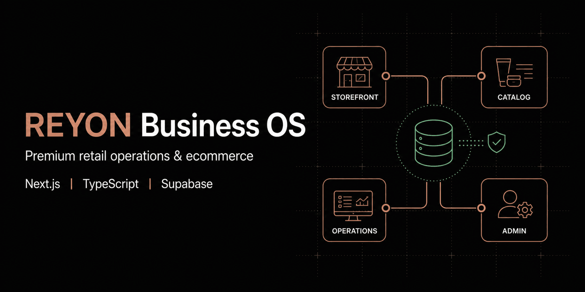
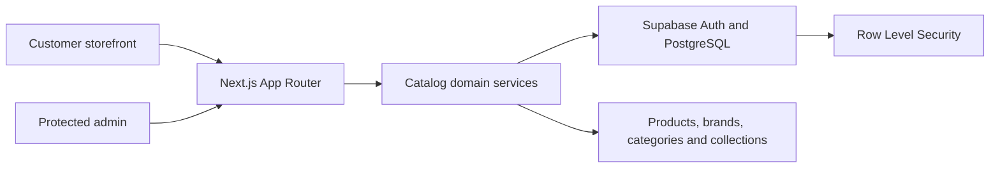

# REYON Business OS

Premium multi-brand beauty retail experience with a governed foundation for catalog and business operations.



[](package.json)
[](docs/13_ROADMAP.md)
[](#technology-stack)
[](tests/domain/catalog-administration.test.ts)

[Live Storefront](https://reyon-online.vercel.app) | [Project Vision](docs/00_PROJECT_VISION.md) | [Architecture](docs/08_DATABASE_ARCHITECTURE.md) | [Roadmap](docs/13_ROADMAP.md) | [Security](SECURITY.md)

## Overview

REYON Business OS combines a responsive customer storefront with a governed operational foundation for a premium multi-brand beauty and personal-care retailer. The current implementation delivers catalog browsing, search, categories, dynamic collections, protected administration, and database-backed brand and product management. Broader order, inventory, purchasing, finance, CRM, analytics, automation, and AI capabilities remain documented future scope rather than released features.

## Implemented Capabilities

- Responsive storefront, product discovery, search, category, and product-detail routes
- Database-driven brands, categories, products, variants, media, and dynamic collections
- Protected administrator authentication with explicit membership provisioning
- Catalog lifecycle and visibility rules backed by Supabase migrations
- Product, brand, category, and collection administration workflows
- SEO metadata, sitemap, robots, policy, contact, and information routes
- Domain tests for identifiers, variants, lifecycle transitions, visibility, and money rules

## Screenshots

### Storefront


### Mobile experience

<p align="center">
  
</p>

## Architecture



Customer routes use governed catalog projections. Protected administrator routes resolve authenticated membership before invoking catalog operations. Supabase migrations define the current data and authorization foundation; domain documents describe future modules without implying they are already active.

## Technology Stack

| Area          | Technology                                    |
| ------------- | --------------------------------------------- |
| Application   | Next.js 16, React 19, TypeScript              |
| Data and auth | Supabase Auth, PostgreSQL, Row Level Security |
| Styling       | CSS design system, Lucide icons               |
| Testing       | Node test runner, Playwright                  |
| Delivery      | Vercel, GitHub Actions                        |

## Local Development

Requirements: Node.js 24, npm, and a development Supabase project.

```bash
git clone https://github.com/itsmebillah/Reyon-Online.git
cd Reyon-Online
npm ci
```

Copy `.env.example` to `.env.local` and configure the public Supabase project values:

```dotenv
NEXT_PUBLIC_SUPABASE_URL=https://your-project.supabase.co
NEXT_PUBLIC_SUPABASE_PUBLISHABLE_KEY=your-publishable-key
```

Apply the reviewed migrations in `supabase/migrations/`, then run:

```bash
npm run dev
```

## Verification

```bash
npm run format:check
npm run lint
npm run typecheck
npm run test:domain
npm run build
npm run test:e2e
```

The current domain suite contains eight passing tests. End-to-end tests require the documented isolated environment and Microsoft Edge setup.

## Documentation

| Area                 | Start here                                                                                                                                                                                     |
| -------------------- | ---------------------------------------------------------------------------------------------------------------------------------------------------------------------------------------------- |
| Product and business | [Vision](docs/00_PROJECT_VISION.md), [Business Overview](docs/01_BUSINESS_OVERVIEW.md), [Business Rules](docs/02_BUSINESS_RULES.md)                                                            |
| Catalog              | [Catalog Architecture](docs/18_PRODUCT_CATALOG_ARCHITECTURE.md), [Administration Decisions](docs/25_PRODUCT_CATALOG_ADMIN_DISCOVERY.md), [Collections](docs/27_DYNAMIC_PRODUCT_COLLECTIONS.md) |
| Operations           | [Order Lifecycle](docs/04_ORDER_LIFECYCLE.md), [Inventory](docs/05_INVENTORY_SYSTEM.md), [Purchasing](docs/06_PURCHASE_SYSTEM.md)                                                              |
| Platform             | [Database](docs/08_DATABASE_ARCHITECTURE.md), [Tech Stack](docs/10_TECH_STACK.md), [Delivery Assurance](docs/26_DELIVERY_ASSURANCE.md)                                                         |
| Future systems       | [CRM](docs/22_CUSTOMER_CRM_IDENTITY_ARCHITECTURE.md), [Analytics](docs/23_REPORTING_ANALYTICS_CONTRACT_ARCHITECTURE.md), [Automation](docs/24_AUTOMATION_CONTROL_PLANE_ARCHITECTURE.md)        |

## Roadmap

See [docs/13_ROADMAP.md](docs/13_ROADMAP.md). Documentation distinguishes approved implementation from target architecture; module inclusion in the business vision is not a claim that the workflow is released.

## Contributing and License

Read [CONTRIBUTING.md](CONTRIBUTING.md) and [SECURITY.md](SECURITY.md). No open-source license has been selected; all rights remain with the repository owner unless a license is added.

---

**Md. Masum Billah** · Data Analyst | Automation Developer | Business Intelligence Specialist

[Portfolio](https://itsmebillah.github.io/) · [GitHub](https://github.com/itsmebillah) · [LinkedIn](https://www.linkedin.com/in/itsmebillah/) · [Email](mailto:itsmbillah@gmail.com) · [Live Storefront](https://reyon-online.vercel.app) · [Documentation](docs/00_PROJECT_VISION.md)
